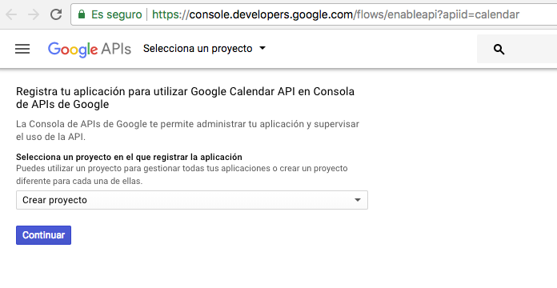
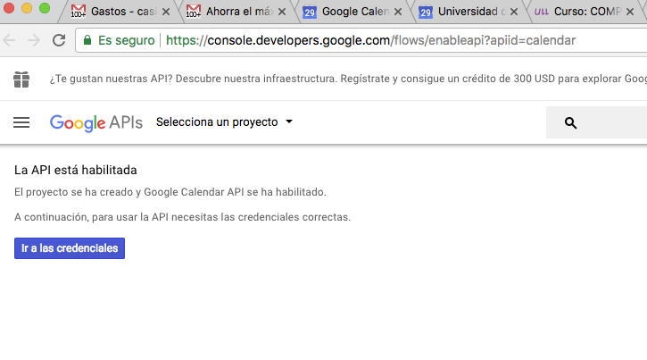
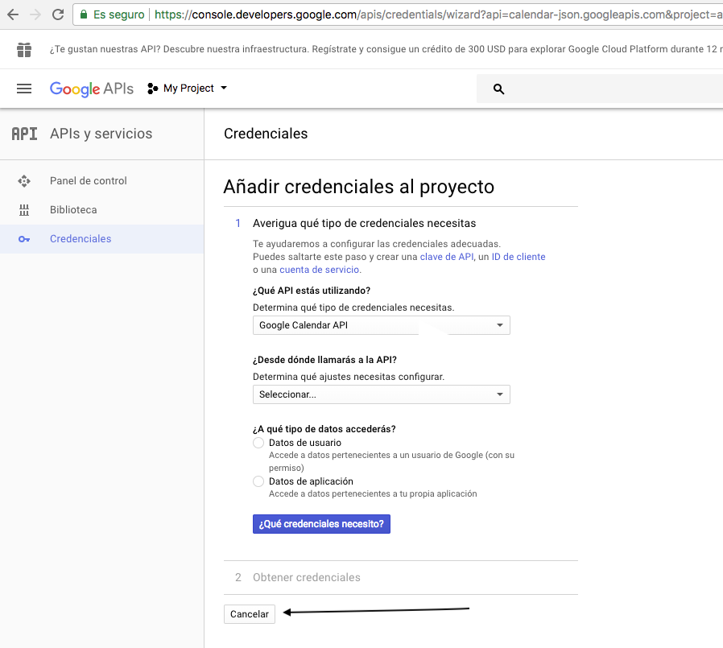
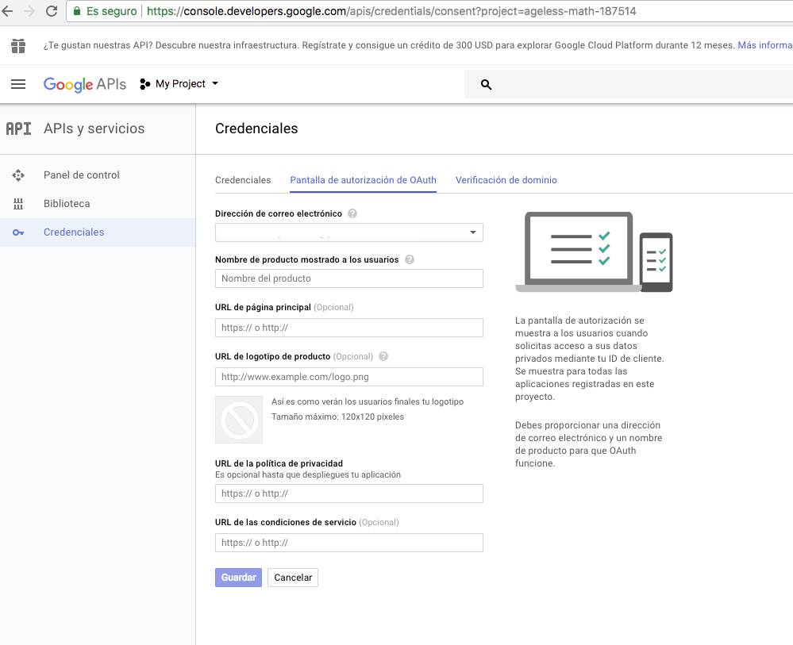
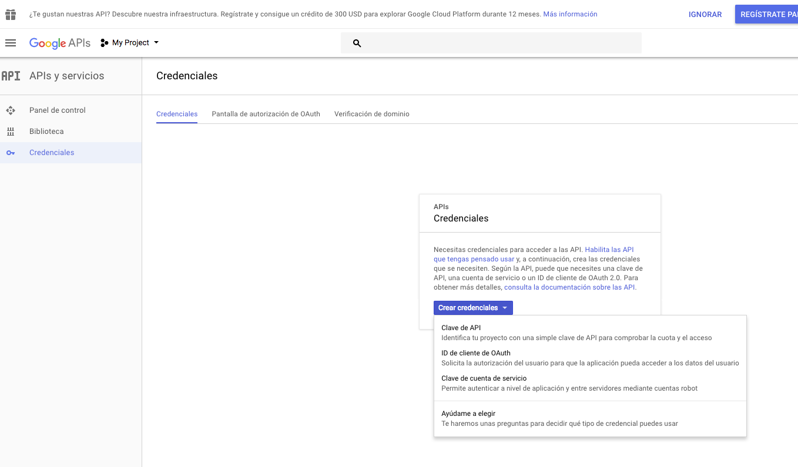

## Google Calendar API

See the tutorial:

* [Node.js Quickstart](https://developers.google.com/google-apps/calendar/quickstart/nodejs)

### Step 1: Turn on the Google Calendar API

1. Use this [wizard](https://console.developers.google.com/start/api?id=calendar) to create or select a project in the Google Developers Console and automatically turn on the API. 

  
  - Click **Continuar**, then **Ir a las credenciales**.

    
2. On the **añadir redenciales al proyecto**, click the **Cancelar** button.
  - 
3. At the top of the page, select the **Pantalla de autorización OAuth** screen tab. 
  - Select an Email address, enter a Product name if not already set, and click the **Guardar** button.
  - 
4. Select the Credentials tab, click the **Crear credenciales** button and select **ID del cliente OAuth**.
  - 
5. Select the application type Other, enter the name "Google Calendar API Quickstart", and click the Create button.
6. Click OK to dismiss the resulting dialog.
7. Click the `file_download` (Download JSON) button to the right of the client ID.
8. Move this file to your working directory and rename it `client_secret.json`.

  ```json
      {"installed": {
              "client_id":"blahblah.apps.googleusercontent.com",
              "project_id":"ageless-math-187514",
              "auth_uri":"https://accounts.google.com/o/oauth2/auth",
              "token_uri":"https://accounts.google.com/o/oauth2/token",
              "auth_provider_x509_cert_url":"https://www.googleapis.com/oauth2/v1/certs",
              "client_secret":"blahblahblah",
              "redirect_uris":["urn:ietf:wg:oauth:2.0:oob","http://localhost"]
           }
      }
  ```


### Step 2: Install the client library

Run the following commands to install the libraries using npm:

```
  npm install googleapis --save
  npm install google-auth-library --save
```

* [GitHub repo google/google-api-nodejs-client](https://github.com/google/google-api-nodejs-client) Google's officially supported Node.js client library for accessing Google APIs.
* [google/google-auth-library-nodejs](https://github.com/google/google-auth-library-nodejs)


### Step 3: Set up the sample

Create a file named quickstart.js in your working directory and copy in the following code:


```js
var fs = require('fs');
var readline = require('readline');
var google = require('googleapis');
var googleAuth = require('google-auth-library');

// If modifying these scopes, delete your previously saved credentials
// at ~/.credentials/calendar-nodejs-quickstart.json
var SCOPES = ['https://www.googleapis.com/auth/calendar.readonly'];
var TOKEN_DIR = (process.env.HOME || process.env.HOMEPATH ||
    process.env.USERPROFILE) + '/.credentials/';
var TOKEN_PATH = TOKEN_DIR + 'calendar-nodejs-quickstart.json';

// Load client secrets from a local file.
fs.readFile('client_secret.json', function processClientSecrets(err, content) {
  if (err) {
    console.log('Error loading client secret file: ' + err);
    return;
  }
  // Authorize a client with the loaded credentials, then call the
  // Google Calendar API.
  authorize(JSON.parse(content), listEvents);
});

/**
 * Create an OAuth2 client with the given credentials, and then execute the
 * given callback function.
 *
 * @param {Object} credentials The authorization client credentials.
 * @param {function} callback The callback to call with the authorized client.
 */
function authorize(credentials, callback) {
  var clientSecret = credentials.installed.client_secret;
  var clientId = credentials.installed.client_id;
  var redirectUrl = credentials.installed.redirect_uris[0];
  var auth = new googleAuth();
  var oauth2Client = new auth.OAuth2(clientId, clientSecret, redirectUrl);

  // Check if we have previously stored a token.
  fs.readFile(TOKEN_PATH, function(err, token) {
    if (err) {
      getNewToken(oauth2Client, callback);
    } else {
      oauth2Client.credentials = JSON.parse(token);
      callback(oauth2Client);
    }
  });
}

/**
 * Get and store new token after prompting for user authorization, and then
 * execute the given callback with the authorized OAuth2 client.
 *
 * @param {google.auth.OAuth2} oauth2Client The OAuth2 client to get token for.
 * @param {getEventsCallback} callback The callback to call with the authorized
 *     client.
 */
function getNewToken(oauth2Client, callback) {
  var authUrl = oauth2Client.generateAuthUrl({
    access_type: 'offline',
    scope: SCOPES
  });
  console.log('Authorize this app by visiting this url: ', authUrl);
  var rl = readline.createInterface({
    input: process.stdin,
    output: process.stdout
  });
  rl.question('Enter the code from that page here: ', function(code) {
    rl.close();
    oauth2Client.getToken(code, function(err, token) {
      if (err) {
        console.log('Error while trying to retrieve access token', err);
        return;
      }
      oauth2Client.credentials = token;
      storeToken(token);
      callback(oauth2Client);
    });
  });
}

/**
 * Store token to disk be used in later program executions.
 *
 * @param {Object} token The token to store to disk.
 */
function storeToken(token) {
  try {
    fs.mkdirSync(TOKEN_DIR);
  } catch (err) {
    if (err.code != 'EEXIST') {
      throw err;
    }
  }
  fs.writeFile(TOKEN_PATH, JSON.stringify(token));
  console.log('Token stored to ' + TOKEN_PATH);
}

/**
 * Lists the next 10 events on the user's primary calendar.
 *
 * @param {google.auth.OAuth2} auth An authorized OAuth2 client.
 */
function listEvents(auth) {
  var calendar = google.calendar('v3');
  calendar.events.list({
    auth: auth,
    calendarId: 'primary',
    timeMin: (new Date()).toISOString(),
    maxResults: 10,
    singleEvents: true,
    orderBy: 'startTime'
  }, function(err, response) {
    if (err) {
      console.log('The API returned an error: ' + err);
      return;
    }
    var events = response.items;
    if (events.length == 0) {
      console.log('No upcoming events found.');
    } else {
      console.log('Upcoming 10 events:');
      for (var i = 0; i < events.length; i++) {
        var event = events[i];
        var start = event.start.dateTime || event.start.date;
        console.log('%s - %s', start, event.summary);
      }
    }
  });
}
```

### Step 4: Run the sample

Run the sample using the following command:

```
  node quickstart.js
```

The first time you run the sample, it will prompt you to authorize access:

1. Browse to the provided URL in your web browser.

  If you are not already logged into your Google account, you will be prompted to log in. If you are logged into multiple Google accounts, you will be asked to select one account to use for the authorization.
2. Click the **Accept** button.
3. Copy the code you're given, paste it into the command-line prompt, and press **Enter**.

```
[~/CA/google-calendar-example(master)]$ cat ~/.credentials/calendar-nodejs-quickstart.json 
{
  "access_token": "blahblah",
  "refresh_token":"blahblah",
  "token_type":"Bearer",
  "expiry_date":9999999999999
}
```

```
[~/CA/google-calendar-example(master)]$ node quickstart.js 
Upcoming 10 events:
2017-11-30T09:00:00Z - Tercer Congreso de Estudiantes de Ingeniería Informática de la ULL
2017-11-30T09:00:00Z - plazo Blah
2017-11-30T09:00:00Z - November 15, 2017: Notification of Acceptance https://www.igi-global.com/publish/call-for-papers/call-details/3020
2017-11-30T12:00:00Z - Reunión Blah
2017-11-30T12:30:00Z - Comisión de Blah
2017-11-30T16:00:00Z - Tercer Congreso de Blah
```
